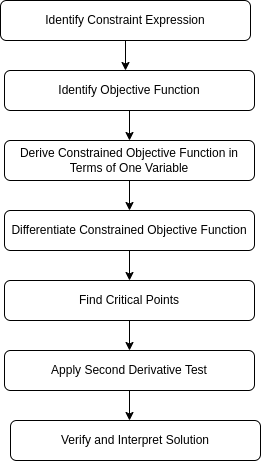
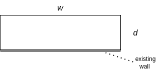

# A Dimwit’s Guide to Calculus Optimization Problem Mastery

As a mathematically challenged student of mathematics, I have found myself constantly tripped up by calculus optimization problems.   This article presents an approach I've hit on that allows me to solve such problems fairly reliably. It's geared toward those who have found themselves in the same boat as me: understanding the basic principles of optimization, able to successfully solve some such problems, but still failing to consistently nail exam questions on the topic.  This article deals with optimization techniques one would learn in a first year calculus course. There are more complex techniques -- involving approaches like Lagrange multipliers -- that I don't cover here.

## What Are Optimization Problems?

Any time you have inputs into a process that can be measured in terms of some scalar value, and you want to find the value of those inputs which result in either the highest or lowest value possible, you are potentially dealing with a problem that can be solved via the optimization techniques presented in this article.

**Example Applications:**

- **Economics:** Business professionals might need to figure out the optimal price for a new product. Too high, and no one buys it; too low, and they sell at a loss.
- **Engineering:** An engineer might be tasked with the design of a container that holds the most volume with the least amount of material.
- **Machine Learning:** A data scientist might need to optimize the cost function of a machine learning model. The cost function measures the error between the predicted outputs and the actual data, and the goal is to minimize this error.

## Process Overview

The diagram below provides an overview of my approach to solving optimization problems. The terms **Constraint Expression** and **Objective Function** might not be commonly used in textbooks, but I think they are helpful concepts for framing the problem correctly before carrying out the mechanical steps of differentiation, setting the first derivative to zero and solving for the target variable, applying the second derivative test, etc.

To illustrate these concepts, let's consider a practical example: designing a poster where you want to minimize the amount of paper used. The poster must have a printed area of exactly 50 square inches, and there must be a 2-inch margin on each side (left and right) and a 4-inch margin on the top and bottom. In this context:

- The **Constraint Expression** captures the requirement that the printed area is fixed at 50 square inches. Specifically, this is given by: ${Area}_{	{text}}  = xy = 50$ where $x$ and $y$ are the width and height of the printed area, respectively.

- The **Objective Function** represents the total area of the paper, including the margins, which we want to minimize. Given the 2-inch margin on the sides and 4-inch margin on the top and bottom, the total dimensions of the paper are $x_{{total}} = x + 4$ and $y_{	{total}} = y + 8$. The Objective Function is:

$$
	{Area}_{	{paper}} =  x_{{total}}  \times y_{{total}}
$$

## Solving the Paper Dimensions Example

To solve the problem of minimizing the total area of paper used for a poster with specific margin requirements, we’ll follow the steps enumerated in our diagram:

### Step 1: Identify the Constraint Expression

Think of the general formula for the quantity you are optimizing. Write the formula as some type of equality that expresses your constraint. In our example, we'd have: ${Area}_{	{text}}  = xy = 50$

### Step 2: Identify the Objective Function

The Objective Function, representing the total area of the paper including margins, would be: ${Area}_{	{paper}} =  x_{{total}}  \times y_{{total}}$

### Step 3: Derive the Constrained Objective Function in Terms of One Variable

Our constraint function suggests how we could express all inputs in terms of one variable (for our example we choose the width: $x$). So, given $y = \frac{50}{x}$, we can now write our Objective Function in terms of $x$.

$$
\text{Area}_{\text{poster}}(x) = (x + 4) \left(\frac{200}{x} + 8\right)
$$

multiplying and collecting like terms then yields:

$$
\text{Area}_{\text{poster}}(x) = \frac{200}{x} + 8x +82
$$

### Step 4: Differentiate the Constrained Objective Function

Now, differentiate the Constrained Objective Function with respect to $x$ to find the critical points. The derivative is:

$$
\frac{dA}{dx} = \frac{d}{dx} (8x + \frac{200}{x} + 82)= 8 - \frac{200}{x^2}
$$

### Step 5: Find Critical Points

To find the critical points, set the derivative equal to zero:

$$
8 - \frac{200}{x^2} = 0
$$

Next, multiply both sides of the equation by $x^2$ to eliminate the denominator:

$$
8x^2 - 200 = 0
$$

Solve for $x$ (perhaps using the quadratic formula if things get more complicated):

$$
x = \sqrt{\frac{200}{8}} = \sqrt{25} = 5
$$

Taking the principal square root (since only positive widths make sense) yields the critical point $x = 5$.

### Step 6: Apply the Second Derivative Test

To confirm that $x = 5$ is indeed a minimum, we apply the second derivative test. We first compute the second derivative of the Constrained Objective Function:

$$
\frac{d^2A}{dx^2} = \frac{d}{dx} \left(8 - \frac{200}{x^2}
\right) = \frac{400}{x^3}
$$

Since $\frac{400}{x^3}$ is positive for all positive $x$, the function is concave up at $x = 5$, confirming that we have a minimum at this point.

### Step 7: Verify and Interpret the Solution

Substitute $x = 5$ back into the expression $y = \frac{50}{x}$
$$
y = \frac{50}{5} = 10
$$

The total paper dimensions are therefore:

- $x_{	{total}} = 5 + 4 = 9$
- $y_{	{total}} = 10 + 8 = 18$

This solution minimizes the total paper area while satisfying the printed area constraint.

## Applying the Method to Different Scenarios

Now that you understand the steps, let's apply the method to a series of increasingly complex optimization problems. These challenges will help reinforce the process and give you practice with different types of constraints and objective functions. For each challenge, consider the questions below

1. What is the Objective Function ?
2. What is the Constraint Expression? Express it mathematically.
3. Using the Constraint Expression, rewrite the Objective Function in terms of a single variable.

### Challenge 1: Minimize the Surface Area of a Cylinder

**Problem Statement:**

You are designing a cylindrical can that must hold exactly 500 cubic centimeters of liquid. You want to minimize the surface area of the can (including the top and bottom). What are the optimal dimensions for the can?

### Challenge 2: Maximize the Volume of a Box with a Fixed Surface Area

**Problem Statement:**

You are constructing an open-top rectangular box with a square base. The material for the base costs $1 per square foot, and the material for the sides costs $2 per square foot. You have $100 to spend. What are the dimensions that maximize the volume of the box?

### Challenge 3: Minimize the Cost of a Pipeline

**Problem Statement:**

A company needs to lay a pipeline from an oil rig located 10 miles offshore to a refinery on the coast 20 miles down the shore from the point closest to the rig. Laying the pipeline underwater costs $500,000 per mile, while laying it on land costs $300,000 per mile. What is the minimum cost to lay the pipeline?

### Challenge 4: Minimize the Perimeter of a Fenced Area

**Problem Statement:**

You need to fence in a rectangular area of 1000 square feet that is adjacent to a long, straight wall. You only need to fence three sides of the rectangle (two parallel sides and one side perpendicular to the wall). What dimensions will minimize the length of the fence required?

## High-Level Solutions to Example Problems

Here are the high-level solutions to the example problems. I won't bore you with the detailed steps because (to me at least), the hard part is problem setup: correctly identifying the Constraint and Objective Functions, and finally, deriving the Constrained Objective Function in terms of one variable.

My other reason is that rather than giving you a fish, I'd rather share some fishing tips. (You like fish, right?). So, what I suggest -- if you can't figure out the detailed steps that lead to the solutions to the problems below -- is that you go *directly* to an AI chat application and ask for a solution. But see caveats at the end of this article

### Solution 1 (Cylinder)
|                                   |                                                                                                     |
|-----------------------------------|-----------------------------------------------------------------------------------------------------|
| _Objective Function_:             | $$Vol = \pi r^2 h = 500 \implies h = \frac{500}{\pi r^2} $$                                         |
| _Constraint Function_:           | $$ Area = 2\pi r h + 2\pi r^2 $$                                                                    |
| _Constrained Objective Function_: | $$    A(r) = 2\pi r \left(\frac{500}{\pi r^2}\right) + 2\pi r^2  $$                                 |
| _Solution_:                       | $$ r = 5 \cdot \left( \frac{2}{\pi} \right)^{1/3} $$  $$h = 2 \cdot \sqrt[3]{\frac{250}{\pi}}$$ |

### Solution 2 (Box)
|                                   |                                                                                           |
|-----------------------------------|-------------------------------------------------------------------------------------------|
| _Objective Function_:             | $$  V = x^2 \times h $$                                                                   |
| _Constraint Function_:            | $$   x^2 \cdot 1 + 4(x \cdot h) \cdot 2 = 100 \implies        h = \frac{100 - x^2}{8x} $$ |
| _Constrained Objective Function_: | $$ V = \frac{x^2 (100 - x^2)}{8x} $$                                                      |
| _Solution_:                       | $$ x = \frac{10}{\sqrt{3}} $$ $$ y =  5/6 \times \sqrt{3}  $$                             |

### Solution 3 (Pipeline)

For this problem it is helpful to draw a diagram, as shown below.  To simplify the formulas we will provide a solution which states the minimum cost of the pipeline in 100's of thousands of dollars.

|                                   |                                                                                                                                                                                                  |
| --------------------------------- | ------------------------------------------------------------------------------------------------------------------------------------------------------------------------------------------------ |
| _Objective Function_:             | $$  \text{Cost}(d)  =  5 \times d  + (20-p) \times 3  $$                                                                                                                                         |
| _Constraint Function_:            | $$ d^2 =   10^2 + p^2  \implies  d =  \sqrt{10^2 + p^2}$$                                                                                                                                        |
| _Constrained Objective Function_: | $$ \text{Cost}(p)  =  5 \times  \sqrt{10^2 + p^2}      + (20-p) \times 3  $$                                                                                                                     |
| _Solution_:                       | Optimal point 'p' where pipeline should meet shore is 7.5 miles from the closest point on shore to refinery. Plugging that into the formula above, we find the cost is 100 * $100K ($10 Million) |

### Solution 4 (Fenced Area)

For this problem it is helpful to draw a diagram, as shown below.

|                                   |                                                             |
|-----------------------------------|-------------------------------------------------------------|
| _Objective Function_:             | $$  Len  = w + 2 \times d  $$                               |
| _Constraint Function_:            | $$  Area = w \times d = 1000 \implies  d = \frac{1000}{w}$$ |
| _Constrained Objective Function_: | $$  Len(w)  = w + 2 \times \frac{1000}{w} $$                |
| _Solution_:                       | $$  d = 10 \sqrt{5}  \text{    and   }  w = 20 \sqrt{5} $$  |

## AI and Learning Math

I used AI assistants to generate the challenge questions in this article, and to check my solutions. Until recently I did not realize how  powerful these things are. Being able to parse and solve calculus word problems  (and respond to questions about specific steps)  -- that is one thing. But the fact that a bot can generate decent suplementary problems when you give it a sample problem and say:  "given me more at about this level of complexity" -- that is pretty impressive. At the time of this writing, monthly subscriptions to AI assistants run about $10 per month. I currently have subscriptions to two: [MathGPT](https://mathgpt.com) and  [ChatGPT](https://openai.com/chatgpt/). The reason why I have two is that these things do make mistakes. So, maybe no need to worry about Skynet. For now ;^)
